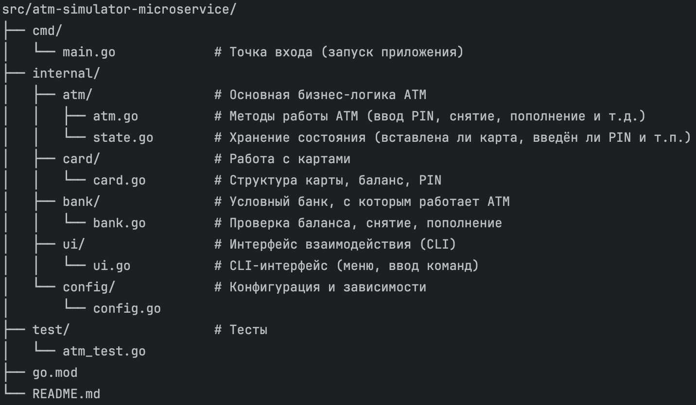

# ATM Simulator

Простой имитатор банкомата на Go. Поддерживает вставку карты, ввод PIN, снятие, пополнение и проверку баланса.

## Structure of the project


src/atm-simulator-microservice/
├── cmd/
│   └── main.go             # Точка входа (запуск приложения)
├── internal/
│   ├── atm/                # Основная бизнес-логика ATM
│   │   ├── atm.go          # Методы работы ATM (ввод PIN, снятие, пополнение и т.д.)
│   │   └── state.go        # Хранение состояния (вставлена ли карта, введён ли PIN и т.п.)
│   ├── card/               # Работа с картами
│   │   └── card.go         # Структура карты, баланс, PIN
│   ├── bank/               # Условный банк, с которым работает ATM
│   │   └── bank.go         # Проверка баланса, снятие, пополнение
│   ├── ui/                 # Интерфейс взаимодействия (CLI)
│   │   └── ui.go           # CLI-интерфейс (меню, ввод команд)
│   └── config/             # Конфигурация и зависимости
│       └── config.go
├── test/                   # Тесты
│   └── atm_test.go
└── go.mod

## Запуск
```
go run cmd/main.go
```

## Тесты
```
go test ./
```
